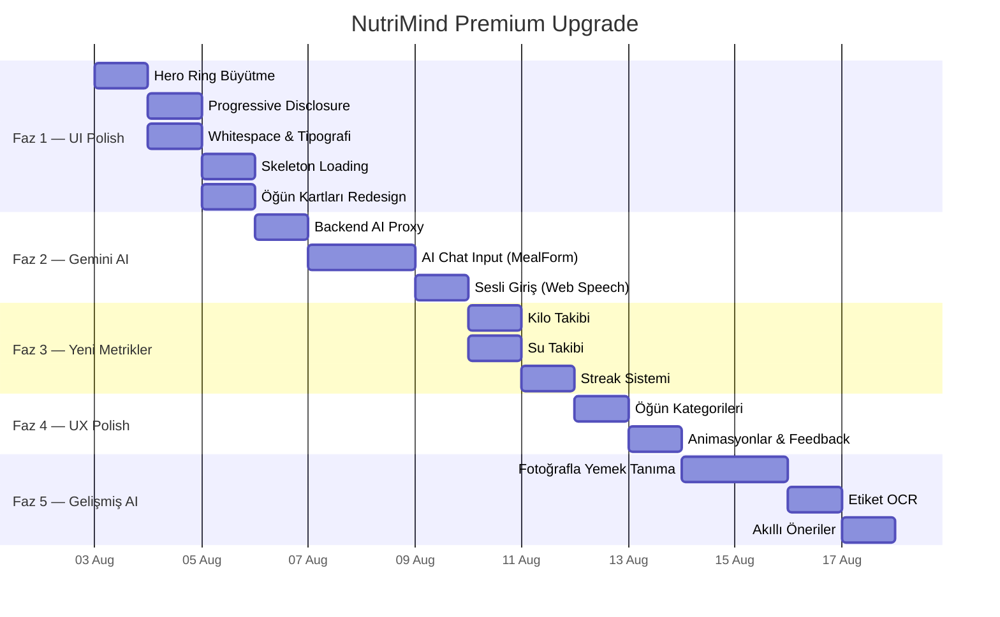

# 🚀 NutriMind Premium Upgrade Plan

> **Tarih:** 2 Ağustos 2026
> **Hazırlayan:** Antigravity AI
> **Hedef:** Mevcut hiçbir özellikten vazgeçmeden, CAL AI'ın premium görünümünü ve eksik özelliklerini NutriMind'a entegre etmek

---

## 🔑 Google API Key Analizi

Elindeki API key (`AIzaSyDnN...`) ile erişebildiğin servisler:

### ✅ Gemini API — TAM ERİŞİM (Ücretsiz)

| Model | Hız | Kalite | Ücretsiz Limit | Kullanım Alanı |
|---|---|---|---|---|
| **`gemini-2.0-flash`** ⭐ | Çok hızlı (~1-2sn) | İyi | **1.500 istek/gün, 15/dk** | Fotoğraf tanıma + doğal dil |
| `gemini-2.0-flash-lite` | En hızlı | Yeterli | 1.500 istek/gün, 30/dk | Basit text parse |
| `gemini-2.5-flash` | Hızlı | Yüksek | 500 istek/gün, 10/dk | Karmaşık yemekler |
| `gemini-2.5-pro` | Yavaş | En yüksek | 25 istek/gün, 5/dk | Fallback |

**Kişisel kullanım için ücretsiz tier fazlasıyla yeterli** — günde 1.500 istek = günde 1.500 yemek fotoğrafı analizi!

### 🎯 Bu Key ile Yapabileceklerin

1. **📸 Fotoğrafla Yemek Tanıma** — Yemek fotoğrafı gönder → AI yemeği tanı + porsiyon tahmin et + kcal/protein/carbs/fat/fiber JSON döndür
2. **💬 Doğal Dil Öğün Girişi** — "200g tavuk göğsü ve pilav yedim" → yapısal JSON
3. **🎤 Sesli Giriş** — Tarayıcının Web Speech API'si (ücretsiz) + Gemini text parse
4. **🧠 Akıllı Besin Tanıma** — Türk yemeklerini tanıyor: menemen, karnıyarık, lahmacun, mercimek çorbası...
5. **📋 Besin Etiketi OCR** — Etiket fotoğrafından makro çıkarma
6. **🔄 Structured JSON Output** — `responseMimeType: "application/json"` ile garanti JSON

### ❌ Bu Key ile Yapamayacakların
- Apple Health / Apple Watch entegrasyonu (PWA limitasyonu)
- Google Fit (deprecated, 2026 sonu kapanıyor)

---

## 📐 Plan Mimarisi

```
┌─────────────────────────────────────────────────────────────┐
│                    UPGRADE PLANI                            │
├─────────────────────────────────────────────────────────────┤
│                                                             │
│  Faz 1: UI Premium Polish ────────── 🎨 Görsel İyileştirme │
│  Faz 2: Gemini AI Entegrasyonu ───── 🤖 AI Özellikleri     │
│  Faz 3: Yeni Takip Metrikleri ────── 📊 Kilo, Su, Streak   │
│  Faz 4: UX İyileştirmeleri ──────── ✨ Animasyon & Polish  │
│  Faz 5: Gelişmiş AI Özellikleri ─── 📸 Fotoğraf & Ses      │
│                                                             │
└─────────────────────────────────────────────────────────────┘
```

---

## Faz 1: UI Premium Polish 🎨

**Hedef:** CAL AI'ın "vay canına" hissi veren premium görünümünü NutriMind'a uyarlamak.
**Süre Tahmini:** 2-3 gün
**Zorluk:** Kolay-Orta
**Backend Değişikliği:** Yok

### 1.1 Hero CalorieRing Büyütme & Yeniden Tasarım

**Mevcut Durum:** CalorieRing 196px, sayfadaki birçok elementten biri.
**Hedef:** CAL AI gibi ekranın %35-40'ını kaplayan, baskın bir hero element.

#### Yapılacaklar:
- [ ] `CalorieRing.tsx` — ring boyutunu responsive yapı: mobilde 220px, tablette 260px
- [ ] Kalan kalori sayısını **font-mono text-4xl font-bold** yaparak baskınlaştır
- [ ] Ring altına ince bir "X kcal kaldı" veya "+X kcal aşıldı" text
- [ ] Ring dolum animasyonunu **800ms ease-out** ile yumuşat (şu an CSS transition var, daha smooth yapılacak)
- [ ] Ring renk geçişini `conic-gradient` içinde daha zengin yapma (tek renk → gradient sweep)

```
Mevcut:                         Hedef:
┌──────────────┐                ┌──────────────────┐
│  [Ring 196px] │                │                  │
│  MacroBars    │                │   [Ring 240px]   │
│  Supplements  │                │    1.247 kcal    │
│  MealList     │                │     kaldı        │
│  WeekBars     │                │                  │
└──────────────┘                │  ── MacroBars ── │
                                 │  MealList        │
                                 └──────────────────┘
```

### 1.2 Progressive Disclosure — Bilgi Katmanlaması

**Mevcut Durum:** DayView'da CalorieRing, MacroBars, SupplementCard, MealList, QuickActions hepsi aynı anda görünüyor.
**Hedef:** İlk bakışta minimal, detaylar istenince açılsın.

#### Yapılacaklar:
- [ ] `DayView.tsx` — SupplementCard'ı varsayılan olarak **collapse** yap, başlık tıklanınca aç
- [ ] Mikro besin satırlarını (sugar, satFat, sodium) varsayılan collapse
- [ ] MealList'te her öğün kartını **compact view** yap: sadece isim + kcal. Tıklanınca makro detay açılsın
- [ ] WeekBars bölümünü DayView'dan kaldırıp sadece History sayfasında göster (veya collapse)
- [ ] Collapse/expand animasyonu: `max-height` transition + `overflow-hidden` (300ms ease-in-out)

### 1.3 Whitespace & Spacing Artırımı

**Hedef:** CAL AI'ın "nefes alan" hissiyatını yakalamak.

#### Yapılacaklar:
- [ ] `tailwind.config.js` — kart arası boşluğu `gap-3` → `gap-4` (veya `gap-5`)
- [ ] Kart iç padding'ini `p-4` → `p-5`
- [ ] CalorieRing kartı üst/alt margin artırma
- [ ] MacroBar satırları arası boşluğu artırma
- [ ] MealList öğeleri arası `divide-y` → `gap-3` ile ayrık kartlar

### 1.4 Tipografi Kontrastı Güçlendirme

**Hedef:** Büyük sayılar BASKICI, etiketler hafif.

#### Yapılacaklar:
- [ ] Kalori sayıları: `font-mono text-3xl font-bold` (mevcut → daha büyük/kalın)
- [ ] Gram sayıları (protein, carbs, fat): `font-mono text-lg font-semibold`
- [ ] Etiketler ("Protein", "Karbonhidrat"): `text-xs text-ink-secondary font-normal uppercase tracking-wider`
- [ ] Tarih göstergesi: `text-sm text-ink-tertiary`

### 1.5 Skeleton Loading Ekle

**Mevcut Durum:** Veri yüklenirken boş ekran veya fadeup.
**Hedef:** CAL AI'daki gibi skeleton placeholder'lar.

#### Yapılacaklar:
- [ ] Yeni bileşen: `Skeleton.tsx` — animasyonlu gri kutular
- [ ] `DayView.tsx` — loading state'de CalorieRing yerine yuvarlak skeleton, MacroBar yerine dikdörtgen skeletonlar
- [ ] Skeleton animasyonu: `@keyframes shimmer` (soldan sağa parlayan gradient)
- [ ] `index.css`'e shimmer keyframe ekle

```css
@keyframes shimmer {
  0% { background-position: -200% 0; }
  100% { background-position: 200% 0; }
}
.skeleton {
  background: linear-gradient(90deg, rgba(255,255,255,0.04) 25%, rgba(255,255,255,0.08) 50%, rgba(255,255,255,0.04) 75%);
  background-size: 200% 100%;
  animation: shimmer 1.5s infinite;
  border-radius: 8px;
}
```

### 1.6 Öğün Kartları Yeniden Tasarım

**Hedef:** Daha modern, "swipeable" hissiyat.

#### Yapılacaklar:
- [ ] Her öğün kartına sol kenarda ince bir renkli çizgi (accent bar): öğünün toplam kalorisine göre renk
- [ ] Kart içi: sol tarafta yemek adı + sağ tarafta kalori (şu anki gibi ama daha compact)
- [ ] Tıklanınca expand: makro breakdown bar'ları + source detayları
- [ ] Kartların arasına hafif `shadow-card` ekle (mevcut Tailwind token'dan)

---

## Faz 2: Gemini AI Entegrasyonu 🤖

**Hedef:** Doğal dil ve fotoğraf tabanlı öğün girişi — CAL AI'ın core özelliği.
**Süre Tahmini:** 3-4 gün
**Zorluk:** Orta
**Backend Değişikliği:** 1 yeni endpoint

### 2.1 Backend: Gemini Proxy Endpoint

**Neden proxy?** API key'i client'ta açıklamak güvenlik riski. Sunucu üzerinden proxy'lemek gerekiyor (Open Food Facts proxy'si ile aynı mantık).

#### Yapılacaklar:

- [ ] `server/index.js`'e yeni endpoint ekle:

```javascript
// POST /api/ai/parse — Doğal dil metin → besin JSON
// POST /api/ai/vision — Base64 fotoğraf → besin JSON
```

- [ ] Gemini API çağrısı:
  - Model: `gemini-2.0-flash`
  - Structured output: `responseMimeType: "application/json"` + `responseSchema`
  - Response şeması NutriMind'ın `Nutrition` interface'ine uyumlu

- [ ] Rate limiting: Token bucket (kişisel kullanım için 10 istek/dk yeterli)
- [ ] Alias context injection: İstek yaparken kullanıcının alias listesini prompt'a ekle (daha doğru sonuç)

#### API Tasarımı:

```
POST /api/ai/parse
Body: { "text": "200g tavuk göğsü ve 1 kase pilav" }
Response: {
  "items": [
    { "name": "Tavuk Göğsü (200g)", "nutrition": { "kcal": 330, "protein": 62, "carbs": 0, "fat": 7, "fiber": 0 } },
    { "name": "Pilav (1 kase)", "nutrition": { "kcal": 240, "protein": 5, "carbs": 52, "fat": 1, "fiber": 1 } }
  ]
}

POST /api/ai/vision
Body: { "image": "<base64>", "mimeType": "image/jpeg" }
Response: { "items": [...] }  // Aynı format
```

#### Prompt Tasarımı:

```
Sen bir beslenme uzmanısın. Kullanıcının öğününü analiz et.

KURALLAR:
- Her yemek öğesini ayrı ayrı listele
- Porsiyon boyutunu gram cinsinden tahmin et
- Besin değerlerini (kcal, protein, carbs, fat, fiber) hesapla
- Türk yemeklerini doğru tanı
- Yanıtı Türkçe ver

KULLANICININ BESİN HAFIZASI (bu besinleri tanıyorsan bu değerleri kullan):
${aliases.map(a => `${a.name}: ${a.serving_g}g başına ${a.nutrition.kcal}kcal, ${a.nutrition.protein}g protein`).join('\n')}

KULLANICININ GİRDİSİ:
${userInput}
```

### 2.2 Frontend: AI Chat Input Alanı

**Hedef:** MealForm'a "AI ile ekle" modu — bir text alanına doğal dilde yaz, AI parse etsin.

#### Yapılacaklar:

- [ ] `MealForm.tsx`'e üçüncü mod ekle: **"Hafızadan" | "Elle" | "AI ile"**
- [ ] "AI ile" modunda:
  - Büyük bir textarea: "Ne yedin? Yaz veya sesli söyle..."
  - Altında "Analiz Et" butonu
  - Submit → `POST /api/ai/parse` → sonuçlar basket'e otomatik eklensin
  - Kullanıcı sonuçları düzenleyebilsin (CAL AI'ın "correction loop"u)
- [ ] Skeleton loading animasyonu: AI yanıt beklerken öğün kartları skeleton olarak gösterilsin
- [ ] `api.ts`'e yeni fonksiyon: `parseWithAI(text: string): Promise<AIParseResult>`
- [ ] `types.ts`'e yeni tip: `AIParseResult`

#### UX Akışı:
```
1. Kullanıcı "AI ile" tabını seçer
2. Textarea'ya yazar: "200g tavuk göğsü, pilav ve salata"
3. "Analiz Et"e basar
4. Skeleton loading gösterilir (1-2 saniye)
5. AI sonuçları basket'e eklenir (her item ayrı kart)
6. Kullanıcı miktarları/değerleri düzenleyebilir
7. "Kaydet"e basınca öğün kaydedilir
```

### 2.3 Sesli Giriş (Web Speech API)

**Hedef:** Textarea'nın yanına mikrofon butonu — konuşarak yemek girişi.
**Maliyet:** Ücretsiz (tarayıcı yerleşik API)

#### Yapılacaklar:
- [ ] `useSpeechRecognition` custom hook oluştur (`src/lib/speech.ts`)
- [ ] Tarayıcı desteği kontrolü (`window.webkitSpeechRecognition || window.SpeechRecognition`)
- [ ] Dil: `tr-TR` (Türkçe)
- [ ] Mikrofon butonu: textarea'nın sağında, basılı tutulduğunda dinle
- [ ] Transkript → textarea'ya yaz → sonra "Analiz Et" ile Gemini'ye gönder
- [ ] Desteklenmiyorsa buton gizlensin

---

## Faz 3: Yeni Takip Metrikleri 📊

**Hedef:** CAL AI'daki kilo, su ve streak takibini eklemek.
**Süre Tahmini:** 2-3 gün
**Zorluk:** Orta
**Backend Değişikliği:** 2 yeni endpoint

### 3.1 Kilo Takibi

#### Backend:
- [ ] `server/index.js`'e yeni endpoint:

```javascript
// POST /api/weight — { date: "2026-08-02", kg: 78.5 }
// GET /api/weight — Tüm kilo kayıtları [{ date, kg }]
// DELETE /api/weight/:date
```

- [ ] Yeni SQLite tablosu: `weight (date TEXT PRIMARY KEY, kg REAL NOT NULL)`

#### Frontend:
- [ ] Yeni bileşen: `WeightCard.tsx`
  - Bugünkü kilo + değişim (önceki kayıda göre)
  - Tıklanınca küçük modal ile kilo girişi
- [ ] `DayView.tsx` — CalorieRing kartının altına WeightCard (gösterilecek veri varsa)
- [ ] `TrendPage.tsx` — Nutrient selector chips'e **"Kilo"** ekle
  - TrendChart'ta kilo eğrisi çizimi (mevcut moving average altyapısını kullansın)
- [ ] `api.ts`'e: `saveWeight(date, kg)`, `fetchWeights()`, `deleteWeight(date)`
- [ ] `types.ts`'e: `WeightEntry { date: string; kg: number }`
- [ ] `data.tsx`'e: weight state + saveWeight action

### 3.2 Su Takibi

#### Backend:
- [ ] Config bag'de sakla: `PUT /api/config/water` (mevcut endpoint yeterli!)
- [ ] Veri formatı: `{ "2026-08-02": 8, "2026-08-01": 6 }` (bardak sayısı)

#### Frontend:
- [ ] Yeni bileşen: `WaterCard.tsx`
  - Günlük su hedefi (varsayılan: 8 bardak = 2L)
  - Büyük su damlası ikonu + "X/8 bardak" göstergesi
  - "+" ve "−" butonları ile bardak ekle/çıkar
  - Su damlası doluluk animasyonu (CSS clip-path veya SVG fill)
- [ ] `DayView.tsx` — CalorieRing'in yanına veya altına WaterCard
- [ ] Hedef bardak sayısı ayarlar → `SettingsSheet.tsx`'e ekle

### 3.3 Streak (Günlük Seri Takibi)

#### Hesaplama:
- Mevcut `days` verisi üzerinden hesaplanabilir — yeni endpoint gereksiz
- Bugünden geriye doğru ardışık gün say (öğün kaydı olan)

#### Frontend:
- [ ] Yeni bileşen: `StreakBadge.tsx`
  - Üst header'da veya CalorieRing kartında
  - "🔥 12 gün" formatında
  - Streak ≥ 7 ise özel animasyon (alev pulse efekti)
- [ ] `lib/streak.ts` — `calculateStreak(days: DayData[]): number` fonksiyonu
- [ ] Vitest testi ekle

---

## Faz 4: UX İyileştirmeleri ✨

**Hedef:** CAL AI seviyesinde smooth, premium hissiyat.
**Süre Tahmini:** 1-2 gün
**Zorluk:** Kolay
**Backend Değişikliği:** Yok

### 4.1 Öğün Kategorileri

**Hedef:** Öğünleri Kahvaltı/Öğle/Akşam/Atıştırmalık olarak grupla.

#### Yapılacaklar:
- [ ] `types.ts` — `MealItem`'a opsiyonel `category?: 'breakfast' | 'lunch' | 'dinner' | 'snack'` ekle
- [ ] Kategori saat bazlı otomatik atansın:
  - 05:00-10:59 → Kahvaltı
  - 11:00-14:59 → Öğle
  - 15:00-20:59 → Akşam
  - 21:00-04:59 → Atıştırmalık
- [ ] `MealForm.tsx` — kategori seçici pill row (override edilebilir)
- [ ] `DayView.tsx` — öğünleri kategoriye göre grupla, her grubun başında başlık

### 4.2 Smooth Geçiş Animasyonları

#### Yapılacaklar:
- [ ] Tab geçişlerine `anim-fadeup` veya horizontal slide ekleme
- [ ] Modal açılış/kapanış: scale(0.95) → scale(1) + opacity 0→1 (250ms ease-out)
- [ ] CalorieRing'in sayı animasyonu: 0'dan hedefe "counting up" efekti (requestAnimationFrame)
- [ ] MealList öğelerine staggered animation delay iyileştirmesi

### 4.3 Haptic-Like Visual Feedback

#### Yapılacaklar:
- [ ] Butonlara `active:scale-95` + `transition-transform duration-100` ekle
- [ ] Swipe aksiyonlarında hafif scale bounce efekti
- [ ] Başarılı kayıt sonrası kısa "✓" checkmark animasyonu (Lottie veya CSS)
- [ ] Hata durumunda kart shake animasyonu

### 4.4 Pull-to-Refresh Hissiyatı

#### Yapılacaklar:
- [ ] DailyPage'de aşağı çekme gesture'ı ile veri yenileme
- [ ] `usePullToRefresh` custom hook
- [ ] Çekme sırasında üstte dönen loader animasyonu
- [ ] Bırakınca `ctx.refresh()` çağır

---

## Faz 5: Gelişmiş AI Özellikleri 📸

**Hedef:** CAL AI'ın fotoğraf tabanlı yemek tanıma ve etiket OCR'ını eklemek.
**Süre Tahmini:** 3-4 gün
**Zorluk:** Orta-Zor
**Backend Değişikliği:** Faz 2'de eklenen AI endpoint'i kullanır

### 5.1 Fotoğrafla Yemek Tanıma

**Hedef:** Kamera aç → fotoğraf çek → AI tanısın → onayla → kaydet.

#### Yapılacaklar:

- [ ] Yeni bileşen: `PhotoCapture.tsx`
  - PWA kamera erişimi: `navigator.mediaDevices.getUserMedia({ video: { facingMode: 'environment' } })`
  - Tam ekran kamera view + büyük "Çek" butonu (CAL AI tarzı)
  - Çekilen fotoğrafı canvas'a çiz → base64'e çevir → boyut optimize (max 1024px)
- [ ] Yeni bileşen: `AIResultSheet.tsx`
  - AI sonuçlarını "onay ekranı" olarak göster
  - Her yemek öğesi düzenlenebilir kart (CAL AI'ın correction loop'u)
  - "Hepsini Ekle" + "İptal" butonları
  - Toplam kalori/makro canlı hesaplanıp gösterilsin
- [ ] DayView QuickActions'a **kamera butonu** ekle (📸 simgesi ile)
- [ ] Akış:

```
1. 📸 butonuna bas
2. Kamera açılır (tam ekran)
3. Fotoğraf çek
4. Skeleton loading (AI analiz ediyor...)
5. Sonuçlar: "Menemen (250g) - 420 kcal" gibi kartlar
6. Kullanıcı düzenler (porsiyon, isim, makro override)
7. "Kaydet" → öğün olarak kaydedilir
8. Opsiyonel: "Hafızaya al" → alias olarak da kaydedilsin
```

### 5.2 Besin Etiketi OCR

**Hedef:** Paketli gıdanın besin değerleri tablosunun fotoğrafını çek → makrolar otomatik dolsun.

#### Yapılacaklar:
- [ ] `POST /api/ai/vision` endpoint'ini genişlet — prompt'a "besin etiketi analizi" modu ekle
- [ ] PhotoCapture'a "Etiket Tara" modu
- [ ] Özel prompt:

```
Bu bir besin değerleri tablosu fotoğrafı. Tablodaki değerleri oku ve aşağıdaki JSON formatında döndür.
100g başına veya porsiyon başına hangisi varsa onu kullan.
```

- [ ] Sonuç → MealForm'a veya doğrudan alias'a aktarılsın

### 5.3 AI ile Alias Otomatik Oluşturma

**Hedef:** Yemek tanıma sonucunu tek tıkla alias hafızasına kaydet.

#### Yapılacaklar:
- [ ] AIResultSheet'teki her öğe kartına "🧠 Hafızaya Al" butonu
- [ ] Tıklanınca:
  - AI'ın tespit ettiği yemek adı → alias `name`
  - Türkçe küçük harf versiyonu → `triggers[0]`
  - Tahmin edilen porsiyon → `serving_g`
  - Hesaplanan makrolar → `nutrition`
- [ ] `upsertAlias()` çağrısı
- [ ] Toast: "✓ {yemek adı} hafızaya kaydedildi"

### 5.4 Akıllı Öneri Sistemi

**Hedef:** Günün saatine ve geçmişe göre "Bugün bunu yemedin" veya "Genellikle bu saatte X yersin" önerileri.

#### Yapılacaklar:
- [ ] `lib/suggestions.ts` — mevcut `aliasRank.ts` altyapısını genişlet
- [ ] DayView'da QuickActions altına "Öneri" pill'leri:
  - Saat bazlı en sık yenilen 3 besin (alias ranking'den)
  - Tıklanınca direkt MealForm'a o alias ile aç

---

## 📦 Yeni Dosya Haritası

Mevcut dosya yapısına eklenecek yeni dosyalar:

```
src/
├── components/
│   ├── Skeleton.tsx           ← [Faz 1] Skeleton loading bileşeni
│   ├── WeightCard.tsx         ← [Faz 3] Kilo takip kartı
│   ├── WaterCard.tsx          ← [Faz 3] Su takip kartı
│   ├── StreakBadge.tsx         ← [Faz 3] Seri göstergesi
│   ├── PhotoCapture.tsx       ← [Faz 5] Kamera yakalama
│   └── AIResultSheet.tsx      ← [Faz 5] AI sonuç onay ekranı
├── lib/
│   ├── speech.ts              ← [Faz 2] Web Speech API hook
│   ├── streak.ts              ← [Faz 3] Streak hesaplama
│   ├── streak.test.ts         ← [Faz 3] Streak testleri
│   ├── suggestions.ts         ← [Faz 5] Akıllı öneri motoru
│   └── camera.ts              ← [Faz 5] Kamera yardımcıları
```

Backend'e eklenecekler:
```
server/
├── index.js                   ← Mevcut (+ AI proxy + weight endpoint)
```

---

## 🔧 Backend Endpoint Özeti

### Yeni Endpoint'ler

| Endpoint | Faz | Açıklama |
|---|---|---|
| `POST /api/ai/parse` | Faz 2 | Doğal dil → besin JSON (Gemini text) |
| `POST /api/ai/vision` | Faz 5 | Fotoğraf → besin JSON (Gemini vision) |
| `POST /api/weight` | Faz 3 | Kilo kaydı upsert |
| `GET /api/weight` | Faz 3 | Tüm kilo kayıtları |
| `DELETE /api/weight/:date` | Faz 3 | Kilo kaydı sil |

### Mevcut Endpoint'ler (Değişiklik Gerektirmeyen)
- `PUT /api/config/water` — Su takibi (config bag)
- `PUT /api/config/supplements` — Supplement takibi (zaten var)
- Alias CRUD — Zaten tam

> [!NOTE]
> **"Frozen backend" kuralına dikkat:** CLAUDE.md'de server/index.js "frozen" olarak işaretli. Bu yeni endpoint'ler eklemeden önce backend freeze'i kaldırmak veya Gemini proxy'sini ayrı bir modüle çıkarmak gerekebilir.

---

## ⏱️ Zaman Çizelgesi



---

## ✅ Dokunulmayacak Mevcut Özellikler

Aşağıdaki özelliklerin **hiçbirine dokunulmayacak**, hepsi olduğu gibi korunacak:

- [x] Alias / Besin Hafızası sistemi (bağlamsal sıralama dahil)
- [x] 1-Tap Scan-to-Log (barkod tarama + Open Food Facts)
- [x] Tarif Oluşturucu (Recipe Builder)
- [x] Çoklu Hedef Profili (v2 GoalConfig)
- [x] Hafta günü bazlı hedef şablonları
- [x] Takviye (Supplement) takibi
- [x] Öğün şablonları ve birleştirme
- [x] Trend analizi (7/30/90 gün + hareketli ortalama)
- [x] Haftalık bar chart ve makro donut
- [x] CSV export / JSON backup-restore
- [x] Yazdırılabilir rapor (ReportView)
- [x] Open Food Facts arama ve ürün proxy'si
- [x] Akıllı miktar tahmini (usualQuantity)
- [x] Birim dönüştürücü (g, adet, kase, dilim...)
- [x] PWA + Service Worker + Offline destek
- [x] Glassmorphism tasarım dili
- [x] Lottie animasyonları
- [x] Gemini CLI entegrasyonu (harici)
- [x] Mikro besin takibi (sugar, satFat, sodium)
- [x] 12 Vitest test suite

---

## 🏁 Başarı Kriterleri

Plan tamamlandığında NutriMind şunları yapabilecek:

1. ✅ CAL AI'ın **premium dark UI hissiyatı** (hero ring, whitespace, skeleton loading)
2. ✅ **Fotoğrafla yemek tanıma** (Gemini Vision — ücretsiz)
3. ✅ **Doğal dil ile öğün girişi** (Gemini Text — uygulama içi)
4. ✅ **Sesli giriş** (Web Speech API — ücretsiz)
5. ✅ **Kilo takibi** + trend grafiği
6. ✅ **Su takibi** + günlük hedef
7. ✅ **Streak sistemi** + motivasyon badge'i
8. ✅ **Öğün kategorileri** (Kahvaltı/Öğle/Akşam/Atıştırmalık)
9. ✅ **Besin etiketi OCR** (Gemini Vision)
10. ✅ **Smooth animasyonlar** + haptic-like feedback
11. ✅ **Progressive disclosure** — temiz ilk izlenim
12. ✅ Mevcut tüm özellikler **aynen korunmuş**

> **Sonuç:** NutriMind, CAL AI'ın sahip olduğu tüm özelliklerle birlikte, CAL AI'ın sahip OLMADIĞI özelliklerle de (alias hafızası, tarif oluşturucu, çoklu hedef, trend analizi, supplement takibi, export/backup...) **açık ara önde** olacak.

---

*Bu plan, NutriMind kaynak kodu analizi (15 kritik dosya), CAL AI araştırması, ve Google Gemini API araştırması baz alınarak hazırlanmıştır.*
